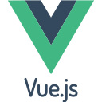
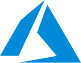

<h1 align="center">
<strong>🙌 ¡Bienvenidos a mi perfil!</strong>   
</h1>

Soy Stivaly Gómez, una desarrolladora en constante aprendizaje y preparada para enfrentar retos tecnológicos. 🚀

    

<h3 align="center">
  <strong>Tecnologías 🤓</strong>    
</h3>

  &nbsp;&nbsp;
  &nbsp;&nbsp;
  &nbsp;&nbsp;
  &nbsp;&nbsp;
  &nbsp;&nbsp;
  &nbsp;&nbsp;
  &nbsp;&nbsp;
  &nbsp;&nbsp;

  

## 🚀 Proyectos Destacados

- **[Fingraphix](https://github.com/Stivaly/FinGraphix):** Sistema de manejo de finanzas personales enfocado en desarrollo backend.

- **[Goal Stats](https://github.com/Stivaly/Goal-Stats):** Aplicación de gestión de tareas con diseño reactivo.

## 🌐 Conecta Conmigo

### 🎯 ¿Quién Soy?
- 🎓 **Formación:** Egresada Técnico Analista Programador con conitnuidad en Ingeniería en Informática en INACAP, con una fuerte base en desarrollo de software, análisis de datos, finanzas y metodologías ágiles.
- 💼 **Experiencia:** He trabajado en proyectos que abarcan desde aplicaciones web con **Vue.js** y **Django**, proyectos en **PHP** y **Laravel** full stack.
- 🌱 **Aprendizaje Continuo:** Siempre estoy buscando aprender nuevas tecnologías, actualmente me encuentro aprendiendo **Java** y realizando la formación para certificación **Azure Fundamentals** y herramientas de patrones de diseño, para mejorar la calidad de los proyectos en los que participo.

### 🗒️ Certificados
- Desarrollador Fullstck - Inacap - Enero 2024
- Diseño y Gestión de Base de Datos - Inacap - Julio 2024
- Diseño Ágil de Sistemas - Inacap - Julio 2024
- Desarrollo de Aplicaciones Básicas - Inacap - Enero 2024
- Soporte Computacional - Inacap - Enero 2024
- Data Analytics Certified Professional - Google - Septiembre 2023
- Scrum Foundation Professional - CertiProf - Agosto 2023
- Seeds for the Future Program - Huawei - Julio 2023

### 🛠️ Lo que me Apasiona
- 🔍 **Resolución de Problemas:** Me encanta enfrentarme a desafíos y encontrar soluciones que no solo funcionen, sino que también sean elegantes y escalables.
- 🎨 **Ingeniería de Datos:** Disfruto diseñar y construir modelos de datos que permitan gestionar bases de datos y optimizar el rendimiento de la entrega de información para la toma de decisiones. Me motiva resolver problemas complejos y garantizar que cada pieza del sistema trabaje en sincronía. Profundizando en la smatemáticas para poder construir modelos de proyección financiera.
- 🤝 **Colaboración:** El trabajando en equipo es de mis mayores fuertes, compartir conocimiento y aprender de los demás ha sido una gran motivación.

### 🌟 Datos Curiosos
- 🎵 **Música:** Me gusta trabajar al ritmo del rock alternativo, el metal y la electrónica 🎸.
- 📚 **Hobbies:** En mi tiempo libre, disfruto leyendo libros de ciencia ficción, tomar café de especialidad, compartir con amigos y jugar videojuegos.

---

Gracias por visitar mi perfil. Espero que encuentres algo interesante en mis proyectos. ¡Nos vemos en el código! 🚀
