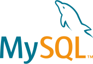
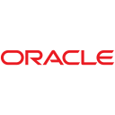

<h1 align="center">
<strong>🙌 Welcome to my profile!</strong>   
</h1>

I am Stivaly Gómez, a developer in constant learning and ready to face technological challenges. 🚀

    

<h3 align="center">
  <strong>Technologies 🤓</strong>    
</h3>

  &nbsp;&nbsp;
  &nbsp;&nbsp;
  &nbsp;&nbsp;
  &nbsp;&nbsp;
  &nbsp;&nbsp;
  &nbsp;&nbsp;
  &nbsp;&nbsp;
  &nbsp;&nbsp;

  

## 🚀 Featured Projects

- **[Fingraphix](https://github.com/Stivaly/FinGraphix):** Personal finance management system focused on backend development.

- **[Goal Stats](https://github.com/Stivaly/Goal-Stats):** Sports monitoring application

## 🌐 Connect With Me

### 🎯 Who am I?
- 🎓 **Training:** Graduated as a Technical Analyst Programmer with a degree in Computer Engineering from INACAP, with a strong background in software development, data analysis, finance and agile methodologies.
- 💼 **Experience:** I have worked on projects ranging from web applications with **Vue.js** and **Django**, projects in **PHP** and **Laravel** full stack.
- 🌱 **Continuous Learning:** I am always looking to learn new technologies, I am currently learning **Java** and doing **Azure Fundamentals** certification training and design pattern tools, to improve the quality of the projects in which I participate.

### 🗒️ Certificates
- Fullstck Developer - Inacap - January 2025
- Database Design and Management - Inacap - July 2024
- Agile Systems Design - Inacap - July 2024
- Basic Applications Development - Inacap - January 2024
- Computer Support - Inacap - January 2024
- Data Analytics Certified Professional - Google - Septiembre 2023
- Scrum Foundation Professional - CertiProf - Agosto 2023
- Seeds for the Future Program - Huawei - Julio 2023

### 🛠️ What I'm Passionate About
- 🔍 **Problem Solving:** I love tackling challenges and finding solutions that not only work, but are also elegant and scalable.
- 🎨 **Data Engineering:** I enjoy designing and building data models to manage databases and optimize the performance of information delivery for decision making. I am motivated by solving complex problems and ensuring that each piece of the system works in sync. Deepening in mathematics to be able to build financial projection models.
- 🤝 **Collaboration:** Teamwork is one of my greatest strengths, sharing knowledge and learning from others has been a great motivation.

### 🌟 Curious Facts
- 🎵 **Music:** I like to work to the rhythms of alternative rock, metal and electronica. 🎸.
- 📚 **Hobbies:** In my free time, I enjoy reading science fiction books, drinking specialty coffee, hanging out with friends and playing video games.

---

Thanks for visiting my profile. I hope you find something interesting in my projects, see you in the code! 🚀
